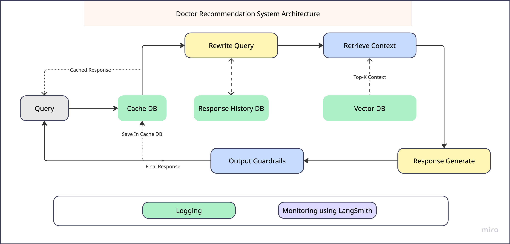

# Doctor_recommendation_system

### Technical Features

1. **Langchain-Based Modular Architecture**
   Utilizes Langchain to build structured and composable chains (retrieval, prompt templates, document chains).

2. **LangSmith Integration**
   Enables observability, debugging, and tracing of chains, prompt flows, and LLM responses for continuous improvement.

3. **Query Normalization Pipeline**
   Custom LLM-based normalization function that extracts `symptom`, `specialization`, and `location` from natural user input.

4. **Contextual RAG Pipeline**
   Combines history-aware question reformulation with document retrieval and response synthesis via `create_retrieval_chain`.

5. **Custom Symptom Clarification Logic**
   Integrates symptom completeness checks before retrieval; triggers follow-up questions when information is missing.

6. **Preprocessing and Indexing Enhancements**
   Knowledge base is preprocessed to extract medical metadata (e.g., symptoms, specialties) for better recall and ranking.

7. **Vectorstore with Chroma (Pluggable)**
   Uses Chroma as a vector database (can be replaced with Qdrant, Weaviate, etc.) with metadata filtering for precise search.

8. **Caching with SQLite**
   Implements Langchain’s `SQLiteCache` to reduce redundant LLM calls and improve latency for repeated queries.

9. **Prompt Engineering with ChatPromptTemplate**
   Dynamically constructed prompt templates using `ChatPromptTemplate` and `MessagesPlaceholder` for multi-turn awareness.
TOdo: 
10. **Output Guardrails**
   To reduce the hallucination and make the output safe.
---

###  How to Run

#### 1. **Install Dependencies**

Make sure you have Python 3.10.9+ installed. Then install required packages:

```bash
pip install -r requirements.txt
```
---

#### 2. **Set Up Environment Variables**

Create a `.env` file or set the following environment variables:

```env
GOOGLE_API_KEY=your-google-api-key   # or Gemini api key
LANGCHAIN_TRACING_V2=true
LANGCHAIN_API_KEY=your-langsmith-api-key
LANGSMITH_ENDPOINT="https://api.smith.langchain.com"
LANGSMITH_PROJECT="Doctor_recommendation_system"
```
---
#### 3. **Start the App (Basic Script Invocation)**
```bash
python main.py
```
---

## 🧠 Explanation of Design Decisions

This section outlines the key architectural and implementation choices made in the development of the medical consultation assistant. These decisions prioritize accuracy, maintainability, and a robust user experience.

**1. RAG Architecture for Dynamic Context Injection**

* **Decision:** I employ a Retrieval-Augmented Generation (RAG) architecture.
* **Rationale:** Medical queries necessitate access to domain-specific and current information regarding doctors and hospitals. RAG ensures that the Large Language Model (LLM) can ground its responses in this pre-indexed data, mitigating the risk of generating inaccurate or fabricated information (hallucinations). Furthermore, this approach decouples the knowledge base from the LLM, allowing for independent updates to the doctor and hospital data without requiring retraining of the language model.

**2. Rewrite query Before Retrieval**

* **Decision:** Before performing retrieval from the vector database, user queries undergo a normalization/rewrite step powered by a dedicated LLM.This approach is crucial for handling multi-turn dialogues effectively.
* **Rationale:** This step perform two thing,
1. For each turn, a standalone query is generated that incorporates the conversation history before performing vector retrieval. This capability significantly improves the naturalness and coherence of the assistant's interactions.
2. aims to extract structured information from these free-form queries, specifically identifying:
    * `symptom`: This structured field is used as the primary input for retrieving relevant information from the vector database.
    * `specialization`: This extracted information helps narrow down the appropriate medical specialties.
    * `location`: This extracted information allows for location-aware responses, such as suggesting nearby doctors or hospitals.
  This structured extraction ensures more consistent and higher-recall searches against the vector database.


**3. Generate Response**

* **Decision:** Using llm generate a response.
* **Rationale:** By sending the relevant information into the prompt,llm will generate response. Specifically, prompt enables the inclusion of:
    * The extracted `symptom`, `location`, and `specialization`.
    * The retrieved context from the vector database.
    This ensures that the LLM has access to both the user's explicit intent (the normalized query) and the relevant background information when generating its response.

**4. LangSmith for Observability**
* **Decision:** I have integrated LangSmith into the system.
* **Rationale:** LangSmith provides critical observability into the behavior of the Langchain components. This integration enables:
    * Detailed tracing of the entire chain execution flow, from query normalization to information retrieval and response generation.
    * Effective debugging of prompt failures, query mismatches, or unexpected behavior at any stage of the process.
    * Valuable insights into user interactions over time, allowing for continuous improvement of the system's performance and user experience.

**5. Modular Vectorstore Layer**

* **Decision:** While i initially implemented ChromaDB for its ease of use in local development, the vectorstore access is designed as a modular layer (encapsulated in `src/chroma_utils.py`).
* **Rationale:** This architectural choice provides flexibility and future-proofing. It allows for seamless swapping of the underlying vector database (e.g., to Weaviate, Qdrant, or Pinecone) without requiring significant modifications to the core logic of the application. Furthermore, this modularity supports the implementation of metadata filtering, enabling us to combine searches based on both the extracted symptom and the user's specified location.

**6. Caching with SQLiteCache**

* **Decision:** I have enabled caching using Langchain's `SQLiteCache`.
* **Rationale:** Caching helps to reduce the number of redundant LLM calls for identical inputs. This is particularly beneficial during the testing phase and in scenarios where users might repeatedly ask for clarification on their symptoms. The caching mechanism is designed to be pluggable, allowing for the adoption of other cache backends if the need arises.


### API endpoint


### Output sample,
#### endpoint input and output:
!(input_sample)[asset/output1.png]
#### input output logs:
Go to app.log to check the .

#### to check in langsmith:
chat monitoring can be visible in langsmith. See this example conversation https://smith.langchain.com/public/f005b2e1-7792-4417-bd7d-fb9779a112ac/r


### Dataset Normalize 
**1. availability field normalize:**
```python
# convert to simplified format
## dataset format
"availability": [
    "sun 06.00 PM - 09.00 PM",
    "mon 06.00 PM - 09.00 PM",
    "tue 06.00 PM - 09.00 PM",
    "wed 06.00 PM - 09.00 PM",
    "thu 06.00 PM - 09.00 PM",
    "",
    "sat 06.00 PM - 09.00 PM"
  ]

  ## simplified format
  "availability": [
    "Saturday to Thursday: 06:00 PM - 09:00 PM",
    "Friday: Off"
  ]
```


```python
## this is a dataset sample
  {
    "_id": {
        "$oid": "67fe06cf13b6d75e7dd15d48"
    },
    "doctor_url": "https://www.doctorspedia.co/doctor/dr-md-forhad-jamal",
    "availability": [
        "sun 06.00 PM - 09.00 PM",
        "mon 06.00 PM - 09.00 PM",
        "tue 06.00 PM - 09.00 PM",
        "wed 06.00 PM - 09.00 PM",
        "thu 06.00 PM - 09.00 PM",
        "",
        "sat 06.00 PM - 09.00 PM"
    ],
    "designation": "MBBS, FCPS(Medicine), MD(Cardiology)",
    "hospital_address": "C-287/2-3 , Bishwa Road, Khilgaon, Dhaka, 1219, Bangladesh",
    "hospital_info": "Khidmah Hospital Private Limited",
    "name": "Dr. Md. Forhad Jamal",
    "reg_no": "N/A",
    "tags": [
        "Angioplasty",
        "Cardioversion",
        "Non-Invasive Cardiology",
        "BP Monitoring",
        "Echocardiography",
        "Aortic Valve Surgery",
        "Chest Pain",
        "ECHO",
        "Heart Disease",
        "Coronary",
        "Heart Attacks",
        "Dyslipidemia",
        "Heart Valve Disease",
        "Blood Pressure",
        "Stress",
        "Stenting",
        "Color doppler"
    ],
    "yoe": "18",
    "hospital_url": "https://www.doctorspedia.co/hospital/khidmah-hospital-private-limited",
    "specialization": "Cardiologist (Heart)"
    }

## this is preprocessed sample for RAG system
{
  "id": "67fe06cf13b6d75e7dd15d48",
  "text": "Dr. Md. Forhad Jamal is a Cardiologist (Heart) with 18 years of experience. He holds the qualifications MBBS, FCPS(Medicine), MD(Cardiology). Currently practicing at Khidmah Hospital Private Limited located at C-287/2-3 , Bishwa Road, Khilgaon, Dhaka, 1219, Bangladesh. Availability: Saturday to Thursday: 06:00 PM - 09:00 PM; Friday: Off. Expertise includes Angioplasty, Cardioversion, Non-Invasive Cardiology, BP Monitoring, Echocardiography, Aortic Valve Surgery, Chest Pain, ECHO, Heart Disease, Coronary, Heart Attacks, Dyslipidemia, Heart Valve Disease, Blood Pressure, Stress, Stenting, Color doppler.For more information about Khidmah Hospital Private Limited, please visit https://www.doctorspedia.co/hospital/khidmah-hospital-private-limited",
  "metadata": {
    "name": "Dr. Md. Forhad Jamal",
    "specialization": "Cardiologist (Heart)",
    "yoe": 18,
    "tags": [
      "Angioplasty",
      "Cardioversion",
      "Non-Invasive Cardiology",
      "BP Monitoring",
      "Echocardiography",
      "Aortic Valve Surgery",
      "Chest Pain",
      "ECHO",
      "Heart Disease",
      "Coronary",
      "Heart Attacks",
      "Dyslipidemia",
      "Heart Valve Disease",
      "Blood Pressure",
      "Stress",
      "Stenting",
      "Color doppler"
    ],
    "designation": "MBBS, FCPS(Medicine), MD(Cardiology)",
    "hospital": "Khidmah Hospital Private Limited",
    "hospital_address": "C-287/2-3 , Bishwa Road, Khilgaon, Dhaka, 1219, Bangladesh",
    "availability": [
      "Saturday to Thursday: 06:00 PM - 09:00 PM",
      "Friday: Off"
    ]
  }
}

```
**2. Insert specialization:**

 Added some specialization based on tags and designation


### Optimization scope
This system, while functional, has several areas identified for potential optimization and enhancement:

1.  **Intelligent Symptom Narrowing and Conversational Flow:**
    * Currently, the system might directly query the retrieval system based on the initial user input. To improve the conversational experience and refine the search, future development will focus on implementing a mechanism to first **narrow down the user's symptoms and other specifications through conversational turns** before triggering the doctor retrieval. This could involve asking clarifying questions to better understand the user's needs.
    * The current approach of calling the retrieval system on every turn can be optimized by potentially using **Langchain Agents and Tools**. An agent could be designed to decide when it's necessary to invoke the retrieval tool based on the level of information gathered conversationally.

2.  **Enhanced Retrieval System:**
    * The retrieval system, which currently relies on vector similarity search, can be improved by incorporating a **keyword-based search mechanism**. This hybrid approach could enhance recall by matching explicit terms in the user's query with relevant keywords in the doctor data, especially for specific conditions or specializations.

3.  **Query Normalization for Intent Understanding:**
    * To better understand the user's intent, the incoming queries need to be **normalized**. This involves techniques like stemming, lemmatization, and handling synonyms to ensure that variations in user language are mapped to consistent representations for more accurate retrieval.

4.  **Optimized Vector Database:**
    * The current vector database can potentially be replaced with a **more optimized database** that offers better performance in terms of indexing speed, query latency, and scalability for the specific needs of this application. Evaluating alternatives like Milvus, Weaviate, or specialized cloud-based vector search services could be beneficial.

5.  **Preprocessing Pipeline Optimization:**
    * The preprocessing steps involved in preparing the doctor data for the vector database can be further **optimized** to improve efficiency and the quality of the embeddings generated. This could involve refining data cleaning techniques, text chunking strategies, and embedding model selection.

6.  **Fallback and Guardrails:**
    * To enhance the robustness and user experience, the system should include **Fallback mechanisms** to handle cases where no relevant doctors are found or the user's query is unclear. Additionally, **Guardrails** should be implemented to prevent the system from providing inappropriate or harmful medical advice, ensuring it strictly adheres to its role as a recommendation system based on the provided data.